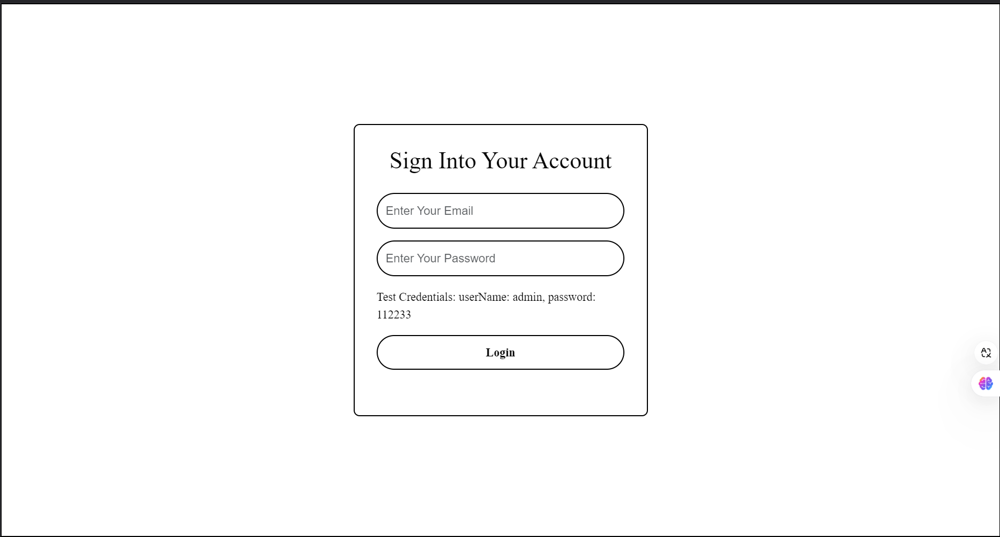
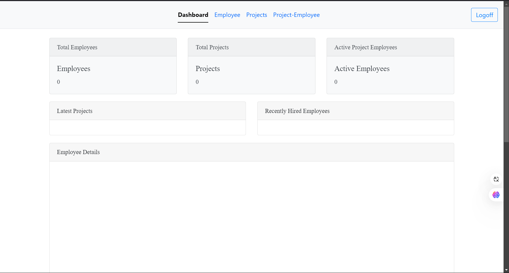
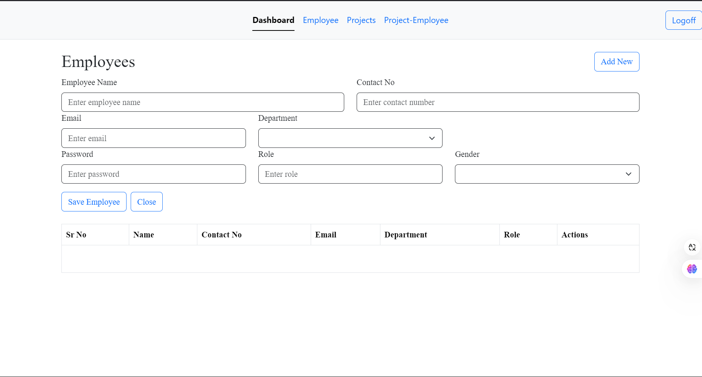
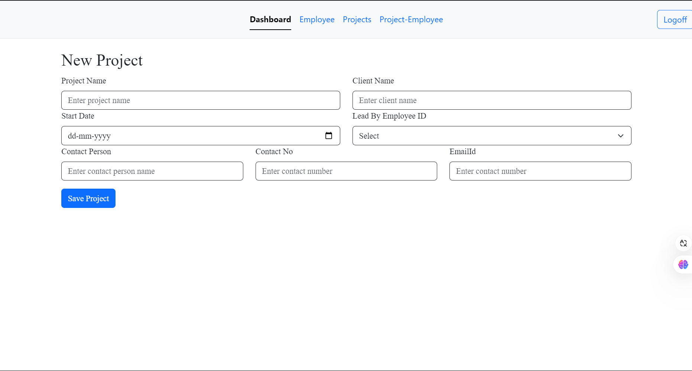
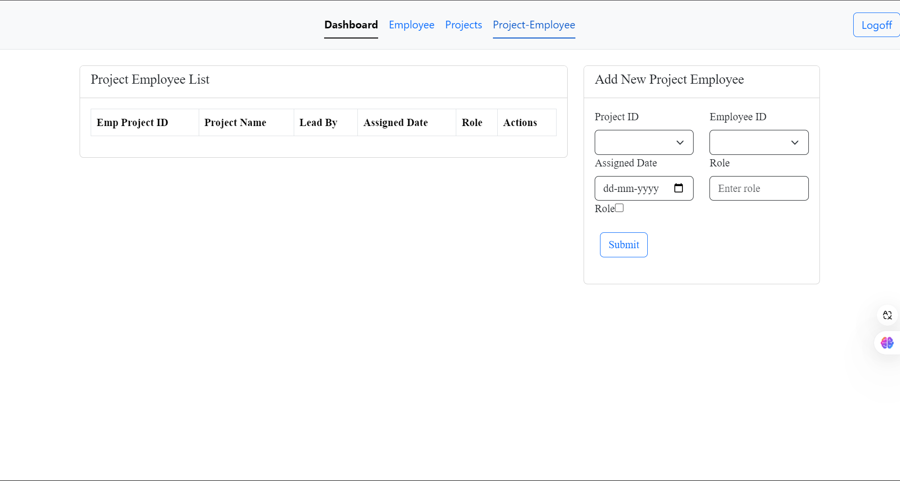

# Employees management app 
- In order to develop this project effectively, we decided to utilize Angular as our framework for the frontend interface, ensuring a dynamic and responsive user experience. On the backend side, we implemented Node.js alongside the Express framework, which allows for streamlined server-side operations and routing. For our data storage needs, we opted for MySQL as the database solution, providing us with a robust and reliable environment to manage our data efficiently.
- For this project, we developed a total of five distinct pages. These include the Login page, where users can authenticate their access, the Dashboard page that serves as an overview of key information, the Employees page which focuses on personnel data, the Projects page detailing various initiatives, and finally, the Employees-Projects page that combines information on both employees and projects. You can view a visual representation of all these pages in the attached screenshot for your reference.
- Here, the administrator has the ability to log in using a combination of a username and a password, utilizing the specific credentials provided for access.
- On this page, the Administrator has the capability to view the overall Total Employees currently working in the organization. This section also provides insights into the Total Projects that are being managed within the company. Additionally, there is a specific category for Projects, where details can be accessed. Furthermore, the Admin can monitor the number of Active Project Employees, which highlights those individuals currently engaged in ongoing projects. There is also a segment dedicated to Active Employees involved in the Latest Projects, ensuring that the Administrator is well-informed about the most current undertakings. Lastly, the page displays information about Recently Hired Employees, giving a clear overview of the newest members who have joined the organization.(include agchart and highchart).
- On this page, the administrator has the capability to add new employees by providing specific information related to each individual. The first field required is the Employee Name, where the admin will need to enter the full name of the employee. Next, there is a section labeled Contact No, where the administrator should input the contact number for the employee, ensuring that it is accurate for communication purposes. Following that, the Email field must be filled out, where the admin will enter the employee's email address, which is crucial for correspondence and notifications. Additionally, there is a Department section, requiring the administrator to specify which department the employee will belong to within the organization. Another important aspect is the Password field, where a secure password must be created, allowing the employee to access their account. The Role section is also necessary, where the admin needs to enter the employee’s job role or title to clarify their position within the company. Finally, the Gender field should be filled in, providing the gender identity of the employee, which may be relevant for various administrative and reporting purposes.
- On this particular page, the administrator has the ability to add a new project by providing the following important details. First, there is the section for the Project Name, where you will need to enter the name of the project clearly and accurately. Next, there is a field for the Client Name, where you should enter the name of the client associated with the project. Following that, there is a designated area for the Start Date, which must be input in the format of dd-mm-yyyy to ensure consistency in dates. 

Additionally, you will find a dropdown menu labeled Lead By Employee ID, which allows you to select the ID of the employee leading this project. Furthermore, there is a field for the Contact Person, where you should enter the name of the person who will be the primary contact for this project. To ensure effective communication, you will also need to provide the Contact No, which requires you to enter the contact number for the person named above. Lastly, there is a field labeled EmailId, where you will enter the email address associated with the contact person. This comprehensive set of information will facilitate the successful management of the new project.
- On this page, the administrator has the ability to assign specific projects to employees, utilizing the following information: Emp Project ID, Project Name, Lead By, Assigned Date, Role, and a set of Actions. This system allows for clear tracking and management of project assignments. To make things easier, there is an option to add a new project employee where the administrator can input essential details. The necessary information required for this process includes Project ID, Employee ID, Assigned Date, formatted as dd-mm-yyyy, and the Role that the employee will take on in the project. The administrator is prompted to enter the specific role that the employee will occupy, ensuring that all assignments are clearly defined and easily accessible for future reference.
